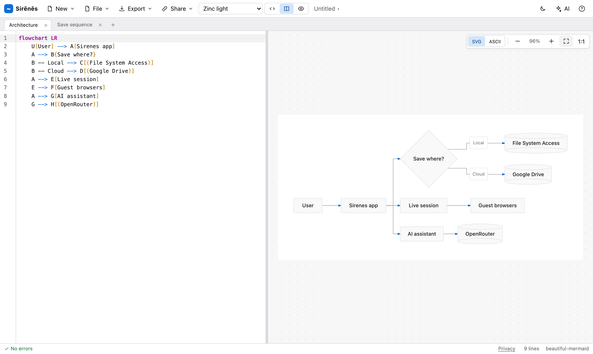
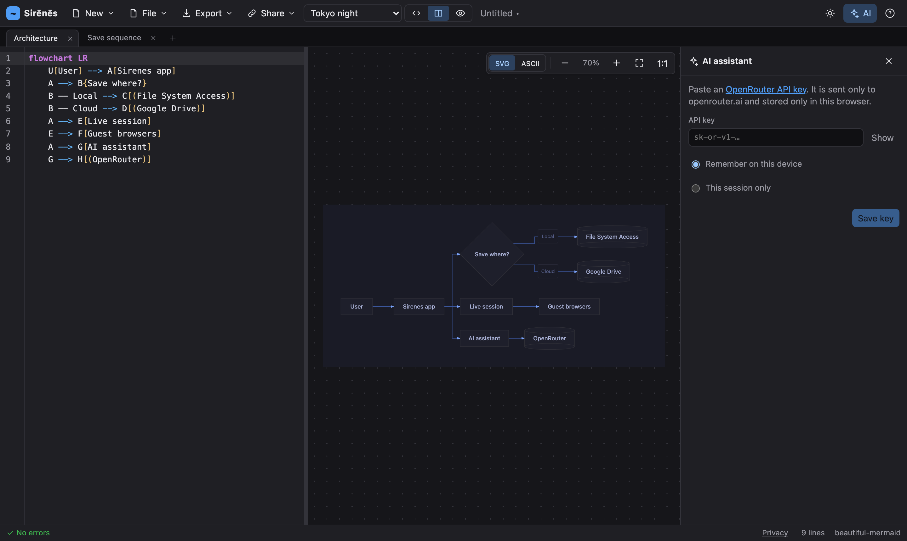

<p align="center">
  
</p>

<h1 align="center">Sirenes</h1>

<p align="center">
  Live Mermaid diagrams in your browser. Nothing to install, nothing uploaded.<br>
  <a href="https://sirenes.vivedo.me/"><strong>sirenes.vivedo.me</strong></a>
</p>

<p align="center">
  
</p>

Type Mermaid on the left and watch the diagram redraw on the right. Save to your disk or your Google Drive, share a diagram as a link, edit it with an AI assistant, or work on it live with other people, browser to browser. Sirenes is a static site with no backend of its own: the only services it ever talks to are the ones you connect, with your own credentials.

_Sirenes_ is the Latin plural of _siren_, the mermaid of classical myth.

## Features

### Editor

- Live preview with a 250 ms debounce. Syntax errors are marked on the offending line, and the last good diagram stays on screen until you fix them.
- CodeMirror 6 editor with Mermaid highlighting, search, and undo history.
- Pan and zoom, fit to screen, and vector-sharp redraws at any zoom level.
- Export to SVG or PNG (1x, 2x, 4x), copy the SVG or the source.
- Editor-only, split, and preview-only layouts. Light and dark interface following your system, with a manual toggle.
- Keyboard shortcuts for everything common. Press `?` to list them.
- Works on phones: one pane at a time with a Code / Preview switch, a compact toolbar, a full-screen assistant, and pinch-to-zoom in the preview.

### Themes and rendering

- Two rendering engines behind one picker. Six [beautiful-mermaid](https://github.com/lukilabs/beautiful-mermaid) themes (Zinc light and dark, GitHub light and dark, Catppuccin latte, Tokyo night) draw flowcharts, sequence, class, state, ER and XY charts. The five classic Mermaid themes cover every diagram type, and Sirenes falls back to them automatically where needed.
- ASCII mode renders the diagram as text, Unicode box drawing or plain characters, ready to paste into a terminal, a commit message, or a code comment.

### Several diagrams in one file

- A `.mmd` file can hold many diagrams. Tabs across the top add, rename, switch and remove them.
- On disk they are separated by a comment line Mermaid ignores:

  ```
  %% sirenes:diagram k7m2p9qx4b Login flow
  flowchart TD
      ...
  %% sirenes:diagram 3nq8vtc2ha Payment
  sequenceDiagram
      ...
  ```

  Every section is still a plain Mermaid diagram, so other tools can read the file. A file without separators is unchanged.

- One file per browser tab. Each tab remembers its own file across reloads; "New file" opens a new tab.

### Share as a link

- The address bar always contains your diagram, compressed. Copy it and anyone can open it. No account, no server, no expiry.
- Links use the same encoding as [mermaid.live](https://mermaid.live), so they open there too, and theirs open here.
- View-only links open in preview mode.

### Files

- **Local files.** Open `.mmd`, `.mermaid`, `.txt` or `.md` files, or drop them on the window. In Chromium browsers, Save writes back to the same file; elsewhere it downloads.
- **Markdown.** Open a `.md` file and Sirenes edits its first `mermaid` block, leaving the rest of the file byte for byte as it was.
- **Google Drive.** Open with the Google picker, save in place, or save a new file into a folder you choose. Sirenes asks for the `drive.file` scope only, so it can see just the files you pick or create with it. If a file changed on Drive since you opened it, you choose between overwriting and saving a copy. Drive's "Open with" links work.

### AI assistant

- Bring your own [OpenRouter](https://openrouter.ai) key. It is stored in this browser, in localStorage or for the session, and sent to nobody but OpenRouter.
- Pick any OpenRouter model, with search, favourites, context length and price per million tokens.
- Ask for changes in plain language. Replies stream in; the proposed diagram is parsed before it is offered, then shown as a side-by-side diff. Accept is a single undo step.
- Presets: fix syntax, explain, simplify, tidy layout, convert to another diagram type. Token and cost usage per reply. Each diagram keeps its own conversation.

<p align="center">
  
</p>

### Live collaboration

- Share → Share live gives you a `#live:` link. People who open it edit the whole file with you in real time: every diagram is shared, participants can work on different diagrams at once, and undo is per person and per diagram.
- Connections are WebRTC data channels straight between browsers, brokered by a PeerJS signalling server that never sees content. Text merges through a Yjs CRDT, so nobody's keystrokes are lost.
- The host stays the owner. Guests see a session title instead of your file name and can only save their own copy. Your files, Drive and AI key never enter the session.
- The AI assistant can be shared too, as one conversation per diagram: guests ask, you run it on your key, everyone sees the answer. Toggles for "guests can edit" and "guests can use my AI assistant" sit in the session panel.
- Details, self-hosting the signalling server and adding a TURN relay: [docs/COLLAB.md](docs/COLLAB.md).

### Privacy

- No analytics, no cookies of our own, no third-party scripts beyond Google's sign-in and picker (loaded only when you use Drive).
- Everything you make stays in your browser until you save or share it. A privacy dialog inside the app, and the full [privacy policy](https://sirenes.vivedo.me/privacy.html) and [terms](https://sirenes.vivedo.me/terms.html), spell out exactly what leaves the browser and to whom.
- "Clear all data" removes everything Sirenes stored, including your key, and revokes the Google token.

## Using it

Open [sirenes.vivedo.me](https://sirenes.vivedo.me/) and start typing. For Google Drive on your own deployment, see [docs/GOOGLE_SETUP.md](docs/GOOGLE_SETUP.md).

Browser support: current Chrome, Edge, Firefox and Safari, on desktop and on phones. Save-in-place for local files needs the File System Access API (Chromium); other browsers fall back to downloads. Live collaboration needs WebRTC and a network path between participants; strict NATs may need a TURN server.

## Development

```sh
npm install
npm run dev          # http://localhost:5173
npm test             # unit tests (Vitest)
npm run test:e2e     # Playwright suite (first time: npx playwright install chromium)
npm run lint         # oxlint + prettier --check
npm run typecheck    # tsc -b
npm run build        # static output in dist/
```

The end-to-end suite stubs OpenRouter, Google and the peer transport, so it needs no credentials. Copy `.env.example` to `.env` to enable Google Drive locally.

## License

[MIT](LICENSE) © 2026 Edoardo Viviani
